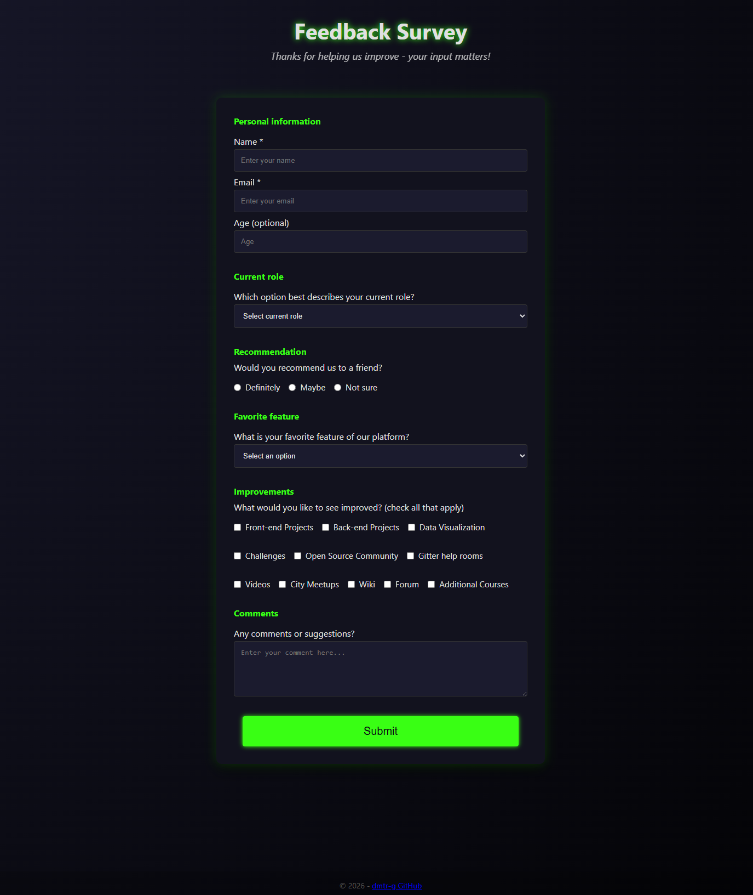

# Survey Form

A styled feedback survey form built with pure HTML and CSS. Dark neon theme, grouped fields, and entrance animations - no JavaScript required.

---

## What it does

Collects user feedback through a structured form: personal details, role selection, a recommendation rating, favourite feature, improvement checkboxes, and a free-text comment box. It's a front-end only template — drop it into any project or connect it to a backend/form service when needed.

---

## Demo

<!-- Add a screenshot here -->


> **To run locally:** open `index.html` directly in any browser. No server needed.

---

## Stack

| Layer | Tech |
|---|---|
| Structure | HTML5 - semantic `fieldset`, `legend`, `label`, `header`, `main`, `footer` |
| Styling | CSS3 - custom properties, flexbox, `accent-color`, keyframe animations |
| Fonts | Segoe UI / system font stack |

No npm. No JavaScript. No dependencies.

---

## Getting started

```bash
# Clone the repo
git clone https://github.com/dmtr-g/survey-form.git
cd survey-form

# Open in browser (pick your OS)
open index.html        # macOS
start index.html       # Windows
xdg-open index.html    # Linux
```

Or just double-click `index.html` in your file explorer.

---

## Features

- **Dark neon theme** - deep background with neon green (`#39ff14`) accent, glowing inputs on focus
- **Grouped fieldsets** - personal info, role, recommendation, favourite feature, improvements, and comments each live in their own `fieldset`
- **CSS `accent-color`** - native checkbox and radio styling to match the theme, no custom wrappers needed
- **Entrance animations** - header fades in, form slides down from above, all via CSS `@keyframes`
- **Neon pulse on the title** - repeating `text-shadow` animation on the `h1`
- **Accessible markup** - all inputs have associated `label` elements, required fields marked with `aria-hidden` asterisks, `novalidate` keeps the UX clean
- **Responsive** - single-column layout that works on any screen size

---

## Project structure

```
survey-form/
├── index.html    # All markup - header, form fieldsets, footer
├── styles.css    # All styling - theme variables, layout, animations
└── README.md
```

---

## What I learned / Why I built this

This was the freeCodeCamp Responsive Web Design survey form project. I went beyond the brief to focus on visual polish and accessibility patterns.

Key things practised:

- Semantic form structure using `fieldset` and `legend` to group related inputs logically
- CSS `accent-color` to style native checkboxes and radio buttons without replacing them with custom elements
- Layered CSS animations — `fadeIn`, `slideDown`, and a repeating `neon` pulse — all triggered on page load without JavaScript
- CSS custom properties for a consistent dark/neon colour palette across every element
- `box-shadow` with `rgba` for the neon glow effect on focus and on the submit button
- `radial-gradient` on the body to create depth without an image

---

## Author

**Dumitru Gafincu** — [github.com/dmtr-g](https://github.com/dmtr-g) — 115009621+dmtr-g@users.noreply.github.com

---

*Built as part of the freeCodeCamp Responsive Web Design curriculum.*
